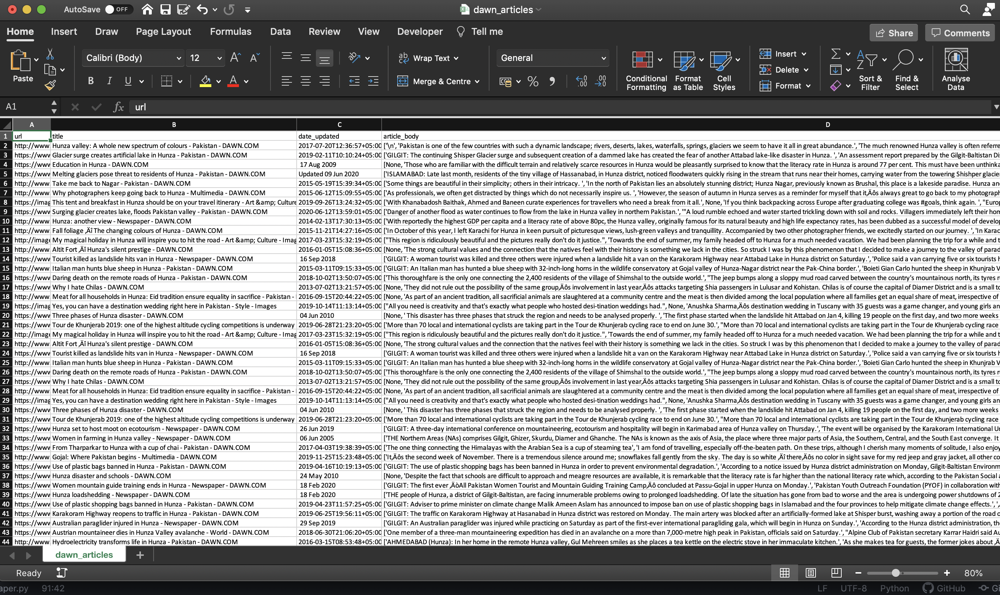

# data-scraping-pakistani-newspapers-in-Python
The application developed in python prompts you to enter a topic of interest and crawls a set of selected newspapers to harvest news articles published online related to the queried topic. 

Kindly use the application to scrape data ethically and only for research/non-commercial purposes. 

Here is how the output looks for DAWN news when we queried 'Hunza'.

